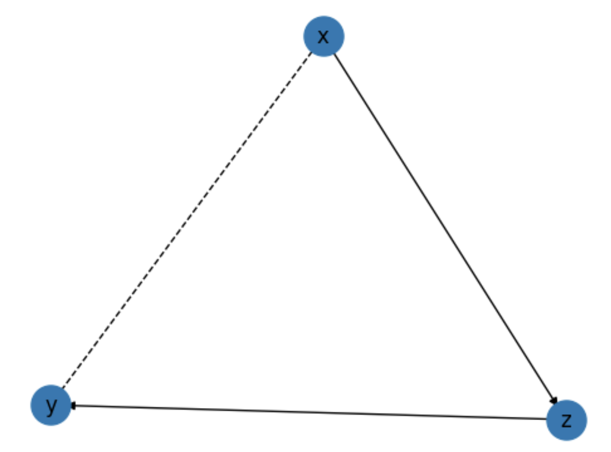

Quickstart
================

Installation
------------
Install ``pqp`` using ``pip``

.. code-block:: bash

    pip install pqp

Usage
------

To characterize a causal effect, we need to specify three things:

#. **Causal Assumptions**: a graph representing the causal structural relationships between variables
#. **Parametric Assumptions**: a parametric model of the joint distribution of the data
#. **Causal Estimand**: an algebraic expression representing the causal effect of interest

Setup
++++++

To get started, we will spoof some data to run our analysis on.

.. code-block:: python

    import pandas as pd

    df = pd.DataFrame({
        "x": [0, 0, 0, 1, 1, 0],
        "z": [0, 1, 0, 1, 1, 0],
        "y": [0, 1, 0, 1, 1, 0],
    })

We can use the ``make_vars`` function to create a list of variables.

.. code-block:: python

    from pqp.symbols import make_vars
    x, y, z = make_vars("xyz")

Note that the names of these variables match the column names in the data frame.

Causal Assumptions
+++++++++++++++++++

We can then assemble these variables into a causal diagram using the ``Graph`` class. Here we will
build the famous front-door model.

Infix operators are used to construct causal relationships.  The ``<=`` operator is used to 
indicate causal influence from right to left, while the ``&`` operator is used to indicate
confounding.

.. code-block:: python

    from pqp.identification import Graph
    g = Graph([
        x & y,
        z <= x,
        y <= z,
    ])

We can use the ``.draw()`` method to visualize the causal diagram.

.. code-block:: python

    g.draw()

Parametric Assumptions
+++++++++++++++++++++++

For the purposes of this article, we will assume that the data is drawn from a multinomial
distribution. We can use the ``MultinomialEstimator`` class to specify the parametric assumptions.

.. code-block:: python

    from pqp.estimation import MultinomialEstimator
    estimator = MultinomialEstimator(df, prior=1)

The ``prior`` argument specifies the prior strength of the model.  The default is
zero, in which case the model fits through maximum likelihood. We are using a nonzero
value here because if you don't specify a prior, the model will not always give positive
probability estimates to events, which can cause problems when estimating causal effects.

If you don't specify a prior, don't worry though. If the estimator runs into a problem,
it will throw an exception and tell you what to do.

Causal Estimand
++++++++++++++++

For this example, we will estimate the average treatment effect of ``x`` on ``y``. First, 
we need to define the treatment and control conditions.

.. code-block:: python

    treatment_condition = [x.val == 1]
    control_condition = [x.val == 0]

Then, we can use the ``ATE`` class to define the causal estimand.

.. code-block:: python

    from pqp.estimation import ATE
    causal_estimand = ATE(y, treatment_condition, control_condition)
    
    #inspect the expression
    causal_estimand.expression().display()

.. image:: imgs/qs_causal_estimand.png
    :width: 500px

Identification and Estimation
+++++++++++++++++++++++++++++++

Now, we can first use the causal assumptions to identify the causal estimand, and then we can use the
parametric assumptions to estimate the causal effect.

To identify the causal relationships in the causal diagram, we can use the ``.identify()`` method.
For example, to identify the causal relationship between ``x`` and ``y``, we can use the following:

.. code-block:: python

    estimand = g.identify(causal_estimand).identified_estimand
    estimand.display()

.. image:: imgs/qs_stat_estimand.png
    :width: 600px

We can then use the ``.estimate()`` method to estimate the causal effect.

.. code-block:: python

    effect = estimator.estimate(estimand)
    effect
    # => EstimationResult(value=0.4433808167141502)

Interpretability and Robustness
++++++++++++++++++++++++++++++++

One of the most important features of ``pqp`` is its ability to provide human-interpretable explanations of the workings of the code. Many of the routines make very specific assumptions about the structure of the data or the effects of interest. It's important for users to understand these assumptions so they can understand the potential limitations of an analysis.

The currency of ``pqp`` is the ``Result`` class. Any calculations that draw conclusions from the data will return instances of this class. This class tracks the transformations and assumptions made by the algorithms. As ``Results`` are assembled into successively more complex analyses of the data, ``pqp`` builds a dependency graph which tracks how different ``Result`` instances relate to each other and allows the user access to a list of steps executed in an analysis and the assumptions made.

To access the list of steps, we can use the ``.explain()`` and ``explain_all()`` methods, which detail the current result only or all results in the dependency graph, respectively.

.. code-block:: python

    estimator.estimate(estimand).explain()

Output:

.. code-block::

    Data Processing
        Assume: x is on BinaryDomain()
        Assume: z is on BinaryDomain()
        Assume: y is on BinaryDomain()
    Identification
        We will identify the average treatment effect using IDC.
        Assume: Noncontradictory evidence
        Assume: Acyclicity
        Assume: Positivty
        IDC
            Input:
            P(y| do(x))
            Output:
            Σ_(z) [ [Σ_(x) [ [P(x) * P(x, z, y) / P(x, z)] ] * P(x, z) / P(x)] ]
        Derived: identified_estimand = E_(y) [ Σ_(z) [ [Σ_(x) [ [P(x) * P(x, z, y) / P(x, z)] ] * P(x = 1, z) / P(x = 1)] ] ] - E_(y) [ Σ_(z) [ [Σ_(x) [ [P(x) * P(x, z, y) / P(x, z)] ] * P(x = 0, z) / P(x = 0)] ] ]
    Fit MultinomialEstimator
        Assume: Multinomial likelihood
        Assume: Dirichlet prior
    Estimation
        Performing brute force estimation using a multinomial likelihood and dirichlet prior.
        Derived: value = 0.4433808167141502