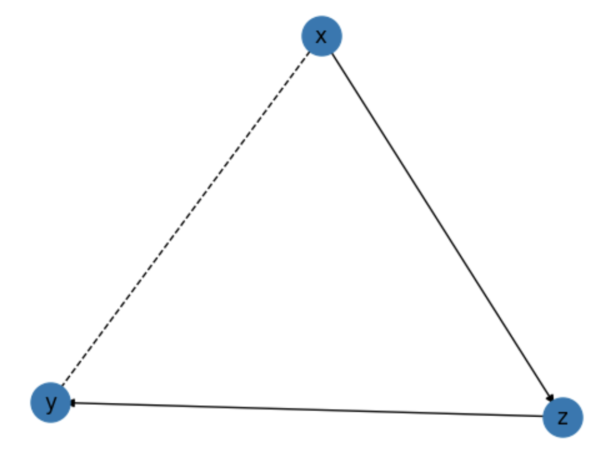
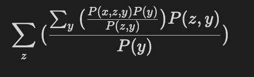

Quickstart
================

The following is a quickstart guide to get you up and running with
``pqp``.  For more detailed information, see the documentation.

Overview
-----
``pqp`` is a Python wrapper for the Rust Library ``pqp``.  The underlying library 
provides performant causal identification using Shpitser's IDC algorithm. The Python wrapper
provides an interface to the underlying library which is designed for easy use within a Jupyter
notebook.

It also provides a few additional features.

- An intuitive API for constructing causal diagrams
- A simple visualization tool for causal diagrams

More features are planned for release soon!

Installation
------------
Install ``pqp`` using ``pip``

.. code-block:: bash

    pip install pqp

Usage
------

To get started, we can first use the ``vars`` function to create a list of variables.

.. code-block:: python

    from pqp import vars
    x, y, z = vars("xyz")

We can then assemble these variables into a causal diagram using the ``Graph`` class. Here we will
build the famous front-door model.

Infix operators are used to construct causal relationships.  The ``<=`` operator is used to 
indicate causal influence from right to left, while the ``&`` operator is used to indicate
confounding.

.. code-block:: python

    from pqp import Graph
    g = Graph([
        z <= x,
        y <= z,
        x & y
    ])

We can use the ``.draw()`` method to visualize the causal diagram.

.. code-block:: python

    g.draw()

To identify the causal relationships in the causal diagram, we can use the ``.idc()`` method.
For example, to identify the causal relationship between ``x`` and ``y``, we can use the following:

.. code-block:: python

    estimand = g.idc([y], [x])
    print(estimand)

    # Σ_(z) [ [Σ_(y) [ [P(x, z, y) * P(y) / P(z, y)] ] * P(z, y) / P(y)] ]

The ``.idc()`` method returns an ``Expression`` object representing the abstract estimator. The
``Expression`` object contains a number of methods for inspecting the estimator.

.. code-block:: python
    str(estimand)
    # Σ_(z) [ [Σ_(y) [ [P(x, z, y) * P(y) / P(z, y)] ] * P(z, y) / P(y)] ]

    estimand.tex()
    # '\\sum_{z} \\big({\\sum_{y} \\big({P(x, z, y) P(y) \\over P(z, y)}\\big) P(z, y) \\over P(y)}\\big)'

Inside an IPython notebook, we can also use the ``.display()`` method to display the estimator
as a LaTeX equation.

.. code-block:: python

    estimand.display()

